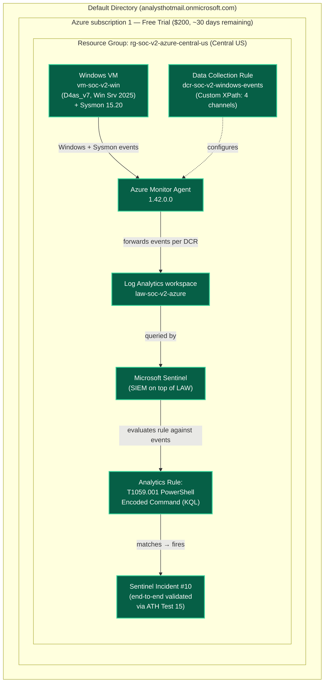

# v2-Azure architecture — current state

**Last updated:** 2026-05-22 (Phase 1 COMPLETE — full chain VM → AMA → DCR → LAW → Sentinel → Incident validated end-to-end via ATH Test 15)

This is the *living* Phase 1 build diagram. It evolves as components come online. For the v1 vs v2-Azure side-by-side comparison see [../README.md](../README.md).

## Phase 1 target

## Legend

- **Green (solid):** Provisioned and active
- **Gray (dashed):** Planned for Phase 1, not yet deployed

## Component notes

- **Windows VM (`vm-soc-v2-win`):** Azure-native (not a hybrid forward from existing on-prem Win10). Standard_D4as_v7 (4 vCPU / 16 GiB, AMD EPYC), Windows Server 2025 Datacenter, Premium SSD LRS, auto-shutdown enabled at 23:59 UTC. Provisioned 2026-05-22. NSG restricts RDP to a single operator source IP. Sysmon 15.20 + SwiftOnSecurity config (SHA256-verified bit-identical to v1) installed 2026-05-22. Full spec at [`../infrastructure/vm-soc-v2-win.md`](../infrastructure/vm-soc-v2-win.md).
- **Azure Monitor Agent (AMA) 1.42.0.0:** Pushed automatically as a VM extension when the VM was associated with the DCR — no manual install step. Replaces the legacy Log Analytics agent (deprecated). Cleaner than v1's Splunk Universal Forwarder model where agent install and filter logic were intertwined in `inputs.conf`.
- **Data Collection Rule (DCR) `dcr-soc-v2-windows-events`:** Defines *what* events get sent from *which* sources to *which* workspace. Decoupled from agent install. Configured with Custom XPath data source collecting four channels: `Application!*`, `Security!*`, `System!*`, `Microsoft-Windows-Sysmon/Operational!*` → all routed to `law-soc-v2-azure`. **Note:** Custom XPath routes everything to the generic `Event` table (including Security events), not to the specialized `SecurityEvent` table. Tradeoff discussion in the Phase 1 detection doc.
- **Log Analytics workspace (`law-soc-v2-azure`):** Pay-as-you-go pricing tier — first 5 GB/month is free under the trial subscription's free tier, and 5 GB/day stays free on the SIEM ingestion side even after Free Trial credits expire.
- **Microsoft Sentinel:** Onboarded to LAW. Sentinel is free for 31 days from onboarding, then bills based on data ingested into the workspace.
- **Analytics Rule (T1059.001):** Phase 1's main functional deliverable. KQL port of the v1 Splunk saved search. Scheduled query rule: every 5 min, 5-min lookback, per-result alerting, 4 entity mappings (Host, Account, 2× Process). Detection doc + saved KQL at [`../detections/t1059-001-powershell-encoded-azure.md`](../detections/t1059-001-powershell-encoded-azure.md). Source-of-truth KQL at [`../detections/kql/t1059-001-powershell-encoded.kql`](../detections/kql/t1059-001-powershell-encoded.kql).
- **Sentinel Incident #10:** Phase 1 success criterion **MET**. Atomic Red Team T1059.001 Test 15 (ATH harness, TestGuid `dd78717b-3d1f-4c0d-ad4c-ce65a977a51a`) fired on VM at 8:11:18 PM Eastern → Sysmon EventID=1 captured → AMA forwarded to LAW → Analytics Rule cron tick at 8:20:42 PM Eastern matched → Sentinel Incident #10 created. End-to-end latency: 9 min 24 sec. Same evidence shape as the v1 IRIS alert #4 from 2026-05-12 (per [`../../vault/detections/t1059-001-powershell-encoded.md`](../../vault/detections/t1059-001-powershell-encoded.md)).

## What this diagram does NOT show yet

- **Phase 2 (SOAR layer):** Logic Apps or Azure Functions → Claude API triage → DFIR-Iris or Sentinel-native incident
- **Phase 2 (enrichment):** VirusTotal + AbuseIPDB tool integrations
- **Cross-cloud question:** whether DFIR-Iris stays as the case-management layer or gets replaced

These will be added in `phase-2-target.md` and `phase-3-target.md` as those phases land.
