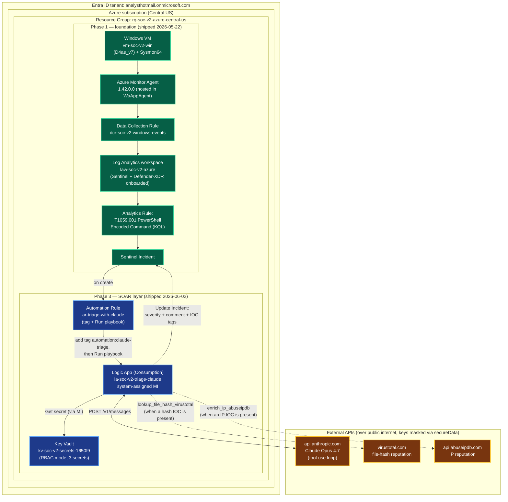

# v2-Azure architecture — current state

**Last updated:** 2026-06-02 (Phase 3 — Microsoft-native SOAR — **SHIPPED**; full automatic chain `fire → Sysmon → AMA → LAW → analytics rule → Sentinel incident → automation rule → Logic App → Claude triage → write-back` validated end-to-end on real Sentinel incident #14)

This is the *living* build diagram for the v2-Azure track. Phase 1 (foundation) shipped 2026-05-22; Phase 3 (the Microsoft-native SOAR layer) shipped 2026-06-02. For the v1 vs v2-Azure side-by-side comparison see [../README.md](../README.md); for the SOAR deliverable + rebuild guide see [../logic-app/DELIVERABLE.md](../logic-app/DELIVERABLE.md) and [../logic-app/runbook.md](../logic-app/runbook.md).

> **Numbering note:** the SOAR layer is "**Phase 3**" under the 2026-05-23 reversal (an intermediate "port v1 to Azure IaaS" phase was inserted ahead of it). The spec/plan *files* are titled "Phase 2" for git-history continuity. Branch: `v3-microsoft-native`.

## Component map — everything built



**Legend:** green = Phase 1 foundation; blue = Phase 3 SOAR layer; brown = external APIs. Dashed enrichment edges fire only when the incident carries an IP or file-hash IOC (see [Known limitation](#known-limitation) — T1059.001 currently surfaces neither).

## Runtime sequence — the real incident #14 run (2026-06-02)

```mermaid
sequenceDiagram
    autonumber
    participant RC as Run Command<br/>(vm-soc-v2-win)
    participant Sys as Sysmon
    participant LAW as Log Analytics
    participant Sen as Analytics Rule
    participant Inc as Sentinel Incident
    participant AR as Automation Rule
    participant LA as Logic App
    participant KV as Key Vault
    participant Claude as Claude Opus 4.7

    RC->>Sys: powershell.exe -EncodedCommand <base64>  (21:28:45Z)
    Sys->>LAW: EventID 1 (ProcessCreate) → AMA ships to Event table (sub-second)
    Note over LAW,Sen: scheduled-rule cadence (~9 min)
    LAW->>Sen: rule queries Event table
    Sen->>Inc: create incident #14
    Inc->>AR: incident-created trigger
    AR->>Inc: add tag automation:claude-triage
    AR->>LA: Run playbook (run starts 21:40:37Z)
    LA->>KV: get 3 secrets via managed identity
    LA->>Claude: POST /v1/messages (incident + 3-tool schema)
    Note over LA,Claude: no IP/hash IOC in entities → no enrichment tool call
    Claude-->>LA: tool_use submit_triage_result<br/>(severity medium; MITRE T1059, T1059.001, T1027)
    LA->>Inc: Update Incident (severity) + Add Comment (markdown triage)
    Note over RC,Inc: end-to-end ~12 min; Logic App run itself 30.58s
```

## Component notes

**Phase 1 (foundation)** — unchanged from 2026-05-22:
- **Windows VM (`vm-soc-v2-win`):** Standard_D4as_v7, Windows Server 2025, Sysmon64 + SwiftOnSecurity config (SHA256-verified bit-identical to v1), auto-shutdown 23:59 UTC. Ops via Azure portal Run Command (Session 0). Spec at [`../infrastructure/vm-soc-v2-win.md`](../infrastructure/vm-soc-v2-win.md).
- **AMA 1.42.0.0:** hosted in the Guest Agent (WaAppAgent), not a standalone Windows service — Heartbeat table is the health signal. Pushed via DCR association.
- **DCR `dcr-soc-v2-windows-events`:** Custom XPath, four channels (Application/Security/System/Sysmon-Operational) → routed to the generic `Event` table.
- **Analytics Rule (T1059.001):** scheduled (5-min run / 5-min lookback, per-event), regex `(?i)\s-e[ncodedommand]*\s` on `powershell.exe`, 4 entity mappings (Host, Account, Process×2). Detection doc at [`../detections/t1059-001-powershell-encoded-azure.md`](../detections/t1059-001-powershell-encoded-azure.md).

**Phase 3 (SOAR layer)** — shipped 2026-06-02:
- **Logic App (`la-soc-v2-triage-claude`, Consumption):** the whole triage agent in one workflow — Sentinel-incident trigger → Key Vault secret reads (managed identity) → a hand-built `Until` loop running the Claude (Opus 4.7) tool-use cycle (3-tool A1 schema, matching v1 verbatim) → terminal `Update Incident` + `Add Comment`. 17 root actions. Exported at [`../logic-app/workflow.json`](../logic-app/workflow.json).
- **Key Vault (`kv-soc-v2-secrets-1650f9`, RBAC mode):** 3 secrets (Anthropic / VirusTotal / AbuseIPDB). No keys in the workflow JSON; read at runtime via the Logic App's system-assigned managed identity, masked in run history via `secureData` on every secret-bearing action.
- **Automation Rule (`ar-triage-with-claude`, Standard):** incident-created trigger, condition `Analytic rule name Contains "T1059.001 - PowerShell Encoded Command"`, two ordered actions (add `automation:claude-triage` tag, then Run playbook). One rule rather than two — avoids the Order-collision race that can silently no-fire.
- **Identity / RBAC (two grants):** *outbound* — the Logic App MI holds `Microsoft Sentinel Responder` (RG) + `Key Vault Secrets User` (vault); *inbound* — the `Azure Security Insights` SP holds `Microsoft Sentinel Automation Contributor` (RG) so Sentinel may invoke the playbook. The inbound grant is the unlock for automatic firing.

## Acceptance evidence

**Phase 1 — Incident #10 (2026-05-22):** ATH Test 15 → Sysmon → AMA → LAW → rule → incident in 9m24s.

**Phase 3 — Incident #14 (2026-06-02):** `-EncodedCommand` fire → fully automatic chain → genuine Claude triage written back (severity medium; MITRE T1059/T1059.001/T1027; IOCs none). End-to-end ~12m20s (Logic App run 30.58s; the rest is scheduled-rule cadence). Full writeup + the "Manual"-label caveat + security-hardening review in [`../logic-app/DELIVERABLE.md`](../logic-app/DELIVERABLE.md).

## Known limitation

The T1059.001 rule *projects* `Hashes` but does not **map** a FileHash entity, and the technique carries no IP — so Claude receives no enrichable IOC and the VirusTotal/AbuseIPDB enrichment tools (the dashed edges above) do not fire on this detection in production. Next step: map the SHA256 from `Hashes` as a FileHash entity to exercise the enrichment path end-to-end. Details in [`../logic-app/DELIVERABLE.md`](../logic-app/DELIVERABLE.md#8-known-limitation--next-step-being-honest).
