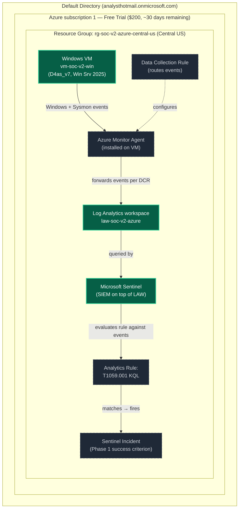

# v2-Azure architecture — current state

**Last updated:** 2026-05-22 (Phase 1, after Central US migration + Windows VM provisioned)

This is the *living* Phase 1 build diagram. It evolves as components come online. For the v1 vs v2-Azure side-by-side comparison see [../README.md](../README.md).

## Phase 1 target

## Legend

- **Green (solid):** Provisioned and active
- **Gray (dashed):** Planned for Phase 1, not yet deployed

## Component notes

- **Windows VM (`vm-soc-v2-win`):** Azure-native (not a hybrid forward from existing on-prem Win10). Standard_D4as_v7 (4 vCPU / 16 GiB, AMD EPYC), Windows Server 2025 Datacenter, Premium SSD LRS, auto-shutdown enabled at 23:59 UTC. Provisioned 2026-05-22. NSG restricts RDP to a single operator source IP — no public exposure beyond that. Full spec at [`../infrastructure/vm-soc-v2-win.md`](../infrastructure/vm-soc-v2-win.md).
- **Azure Monitor Agent (AMA):** Replaces the legacy Log Analytics agent (deprecated). Installs as a VM extension; configuration lives in Data Collection Rules rather than per-machine. This is cleaner than the v1 Splunk Universal Forwarder model where agent install and filter logic were intertwined in `inputs.conf`.
- **Data Collection Rule (DCR):** Defines *what* events get sent from *which* sources to *which* workspace. Decoupled from agent install. For Phase 1 the DCR will ship Windows Security / System / Application channels + Sysmon channel events to `law-soc-v2-azure`.
- **Log Analytics workspace (`law-soc-v2-azure`):** Just provisioned. Pay-as-you-go pricing tier — first 5 GB/month is free under the trial subscription's free tier, and 5 GB/day stays free on the SIEM ingestion side even after Free Trial credits expire.
- **Microsoft Sentinel:** Just onboarded to LAW. Sentinel itself is free for 31 days from onboarding, then bills based on data ingested into the workspace.
- **Analytics Rule (T1059.001):** Phase 1's main functional deliverable. KQL equivalent of the v1 Splunk saved-search detection at [`../../vault/detections/t1059-001-powershell-encoded.md`](../../vault/detections/t1059-001-powershell-encoded.md).
- **Sentinel Incident:** Phase 1 success criterion. When Atomic Red Team fires T1059.001 on the VM, an incident lands in Sentinel — same end-to-end evidence shape as the v1 IRIS alert #4 from 2026-05-12.

## What this diagram does NOT show yet

- **Phase 2 (SOAR layer):** Logic Apps or Azure Functions → Claude API triage → DFIR-Iris or Sentinel-native incident
- **Phase 2 (enrichment):** VirusTotal + AbuseIPDB tool integrations
- **Cross-cloud question:** whether DFIR-Iris stays as the case-management layer or gets replaced

These will be added in `phase-2-target.md` and `phase-3-target.md` as those phases land.
