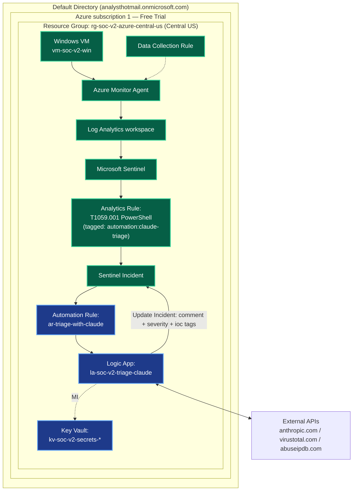

# Phase 2 — SOAR Layer (Logic Apps) Implementation Plan

> **▶ RESUMED 2026-05-26.** Phase 2 (the intermediate Azure Port that interrupted this work) shipped 2026-05-26. This plan is now active and is conceptually **Phase 3** under the post-2026-05-23-reversal numbering. Filename and title still say "Phase 2" for git-history continuity — read every "Phase 2" reference as "Phase 3." See [spec resume-context block](../specs/2026-05-23-phase-2-soar-logic-app-design.md) for what changed in the intervening period (P2 shipped, AMA anomaly on `vm-soc-v2-win` to verify before starting, T1059.003 saved search added on Splunk side but NOT on Sentinel side, Claude empty-`iocs[]` synthetic-event judgment behavior carries over).
>
> **For agentic workers:** REQUIRED SUB-SKILL: Use superpowers:subagent-driven-development (recommended) or superpowers:executing-plans to implement this plan task-by-task. Steps use checkbox (`- [ ]`) syntax for tracking.

**Goal:** Ship the Microsoft-native equivalent of v1's SOC Triage v3 n8n workflow — a single Azure Logic App (Consumption) that triages Sentinel incidents tagged `automation:claude-triage` via Claude tool-use (AbuseIPDB + VirusTotal enrichment, structured triage output) and writes back to the Sentinel incident.

**Architecture:** Pure Logic App with manual `Until` loop for the Claude tool-use cycle (no Azure Function offload). Sentinel Automation Rule fires the Logic App on tagged incidents. Key Vault + managed identity for secrets. Terminates with `Microsoft Sentinel — Update Incident` (comment + severity + IOC tags) — no DFIR-IRIS write-back. Full design rationale in [spec](../specs/2026-05-23-phase-2-soar-logic-app-design.md).

**Tech Stack:** Azure Logic Apps Consumption, Azure Key Vault (RBAC mode), Microsoft Sentinel (Automation Rule + Update Incident action), Anthropic Claude API (claude-opus-4-7), VirusTotal API v3, AbuseIPDB API v2, Atomic Red Team (acceptance test).

---

## File structure

| Path | Status | Responsibility |
|---|---|---|
| `v2-azure/logic-app/workflow.json` | CREATE (Task 16) | Exported Logic App workflow definition — source of truth, mirrors v1's `JSON/SOC-Triage-v3.json` |
| `v2-azure/logic-app/test-fixtures/sample-incident.json` | CREATE (Task 16) | Real Sentinel incident payload captured from a successful acceptance run — used for future regression replay. Smoke tests during Tasks 3-13 use either the Logic Apps designer's auto-generated payload template OR a minimal inline IOC-rich payload provided per-step. |
| `v2-azure/logic-app/runbook.md` | CREATE (Task 17) | Operational runbook — provisioning steps, verification queries, troubleshooting playbook, secrets management |
| `v2-azure/logic-app/README.md` | CREATE (Task 20) | Phase 2 deliverable doc — commentary, v1↔v2 parity table, lessons learned (analog of Phase 1's detection doc) |
| `v2-azure/architecture/current-state.md` | MODIFY (Task 18) | Extend Mermaid diagram with KV, AR, LA nodes flipped to `:::done`; update component notes |
| `v2-azure/README.md` | MODIFY (Task 19) | Check off Phase 2 checklist; add Phase 2 Results table |
| `v2-azure/specs/2026-05-23-phase-2-soar-logic-app-design.md` | MODIFY (Task 21) | Frontmatter `status: draft` → `active` |

**Why `logic-app/` as the folder name, not `phase-2/`:** folders named after temporal phases age poorly; folders named after components age well. Phase 1 went into `detections/` for the same reason.

---

## Testing approach (read before starting)

Logic Apps does not support unit testing the way code does. There is no way to mock an HTTP action inside a Switch branch without temporarily rewiring the workflow. Instead, smoke testing uses two Logic Apps features:

- **Run with payload** — feeds a hand-crafted JSON to the trigger; the workflow runs end-to-end with real HTTP actions. Use the `sample-incident.json` fixture from Task 1.
- **Resubmit** — replays a real prior run with the same payload. Useful after fixing a bug to verify against the original failing input.

The plan's "Smoke test" steps use one of these. Each task verifies that the *cumulative* workflow behaves correctly after the new action is added — this is "build a bit, verify, build a bit more" discipline, not classical TDD red-green-refactor. This divergence is the cost of working in a designer-driven SOAR product; the verification discipline is preserved even though the form is different.

**Commit cadence:** Portal-driven work doesn't produce committable files until the workflow JSON is exported (Task 16). Tasks 1, 16-21 produce file changes and get individual commits. Tasks 2-15 are portal-only and get verified-but-not-committed — the workflow export at Task 16 captures the cumulative work in one commit.

---

## Task 1: Setup verification + Phase 1 trigger-chain live-fire pre-flight

**Files:** none

**Why fixture is deferred:** The original plan had us capture a real Sentinel incident JSON upfront. In practice, this is friction without payoff — neither portal export (CSV-only) nor `az` CLI was an acceptable path. The cleaner shape: smoke tests during Tasks 3-13 use the Logic Apps designer's auto-generated payload template OR minimal inline IOC-rich payloads provided per-step. The actual fixture file gets captured from a real successful run after Task 15 (acceptance run) and committed as part of Task 16.

**Why the new live-fire pre-flight (Steps 3-5):** During the intervening P2 (Azure Port) work, `Get-Service AzureMonitorAgent` on `vm-soc-v2-win` returned not-installed (P2 Task 12 captured anomaly). The Phase 3 trigger chain requires AMA → LAW → analytics rule → Sentinel incident. If AMA is genuinely broken, Phase 3 stalls at trigger creation. Pre-flight verifies the entire upstream chain still works on a fresh fire **before** spending portal time on Key Vault + Logic App provisioning.

- [ ] **Step 1: Confirm branch state**

Run: `git -C SOC_Automation_Project status && git -C SOC_Automation_Project branch --show-current`
Expected: `On branch v3-microsoft-native ... working tree clean` AND current branch is `v3-microsoft-native`.

(The original plan said `v2-azure`. That branch is now the permanent home of the Azure Port — DO NOT execute Phase 3 work on `v2-azure`. Phase 3 work happens here on `v3-microsoft-native` where this plan lives.)

- [ ] **Step 2: Confirm a recent Phase 1 incident exists OR is reachable**

Open Sentinel (portal.azure.com → search "Microsoft Sentinel" → select `law-soc-v2-azure` workspace → Incidents). Look for **the most recent** "T1059.001 - PowerShell Encoded Command" incident. (The original plan referenced Incident #10 — likely stale by 2026-05-26+; trust whatever the latest one is. Phase 1 + recent P2 testing may have created additional incidents.)

If no T1059.001 incident exists in the Sentinel workspace at all, the trigger chain has been broken at some point since 2026-05-22 — proceed to Step 3 to verify whether a fresh fire reaches Sentinel.

- [ ] **Step 3: Live-fire the trigger chain (AMA-side verification)**

Start `vm-soc-v2-win` if deallocated. Via Azure portal Run Command (`vm-soc-v2-win` → Operations → Run command → RunPowerShellScript), paste:

```powershell
$ts = Get-Date -Format 'HH:mm:ss'
$enc = [Convert]::ToBase64String([Text.Encoding]::Unicode.GetBytes("Write-Host `"Phase3-preflight-$ts`""))
"Firing Phase 3 pre-flight at $ts UTC=$([DateTime]::UtcNow.ToString('HH:mm:ss'))"
powershell.exe -NoProfile -EncodedCommand $enc
"Fired."
```

This is the same shape as the Phase 1 T1059.001 analytics rule's KQL match (Sysmon EventID=1 + PowerShell + EncodedCommand). It should propagate AMA → LAW → analytics rule → Sentinel incident.

- [ ] **Step 4: Verify event reaches Log Analytics**

Wait ~3-7 minutes (Phase 1 baseline latency). Run a KQL query in the LAW (`law-soc-v2-azure` → Logs):

```kql
Event
| where TimeGenerated > ago(15m)
| where Source == "Microsoft-Windows-Sysmon"
| where RenderedDescription contains "Phase3-preflight"
| project TimeGenerated, Computer, EventID, RenderedDescription
| take 5
```

Expected: 1+ rows matching the synthetic fire, ingested within 5-10 min of Step 3.

If 0 rows after 15 min: **AMA path is broken.** Diagnose first:
- Service-name check (RDP into `vm-soc-v2-win`): `Get-Service | Where-Object {$_.Name -like '*Monitor*' -or $_.Name -like '*AMA*'}`. Real AMA may be running as `AzureMonitorWindowsAgent` or `AMAExtHandler`, not `AzureMonitorAgent`.
- Extension check (portal): `vm-soc-v2-win` → Extensions + applications → look for `AzureMonitorWindowsAgent`. Should be "Provisioning succeeded."
- DCR check (portal): the Data Collection Rule from Phase 1 should associate this VM as a resource. Verify in Azure Monitor → Data Collection Rules → the Phase 1 DCR → Resources tab.

Fix AMA before continuing. Phase 3 has no path forward without this.

- [ ] **Step 5: Verify Sentinel incident materializes**

Wait up to 5 more minutes after Step 4's event appears in LAW (analytics rule runs on its own schedule). Sentinel → Incidents → confirm a new "T1059.001 - PowerShell Encoded Command" incident appears with creation time post-Step-3 fire.

If LAW has the event but no incident materializes: the analytics rule is misconfigured/disabled. Sentinel → Analytics → confirm the T1059.001 rule from Phase 1 is **Enabled** and its scheduled-rule cadence hasn't been disabled. Re-enable + wait one rule tick.

When this step succeeds: **Phase 1 foundation is verified end-to-end.** Note the incident ID (or just remember "the most recent one"); it's the body Task 14 Step 2 ("manually fire the rule on an existing incident") will replay against.

---

## Task 2: Provision Key Vault and load secrets

**Files:** none (portal-driven; runbook captures in Task 17)

- [ ] **Step 1: Decide Key Vault name with entropy suffix**

Key Vault names are globally unique (3-24 chars, start with letter, alphanumerics + hyphens). Use `kv-soc-v2-secrets-<6-char-suffix>`. Generate suffix:

Run: `python -c "import secrets; print(secrets.token_hex(3))"`
Expected: a 6-character hex string (e.g., `a1b2c3`). Note the full name (e.g., `kv-soc-v2-secrets-a1b2c3`) — used throughout the rest of the plan.

- [ ] **Step 2: Create Key Vault via portal**

Portal → search "Key Vaults" → + Create:
- Subscription: (existing trial sub)
- Resource group: `rg-soc-v2-azure-central-us`
- Name: `kv-soc-v2-secrets-<suffix>`
- Region: `Central US`
- Pricing tier: Standard
- **Access configuration → Permission model: Azure role-based access control** (NOT Vault access policy — RBAC is the current best-practice mode)
- Networking: Public endpoint, all networks (lab scope)
- Review + create.

Expected: Deployment succeeds in ~30 sec.

- [ ] **Step 3: Grant yourself Key Vault Administrator role on the vault**

KV blade → Access control (IAM) → + Add → Add role assignment → Key Vault Administrator → Members: select your user → Review + assign.

Reason: in RBAC mode, even the vault creator cannot read/write secrets without an RBAC role. This step grants you the permission to load secrets in Step 4.

- [ ] **Step 4: Load the three API key secrets**

KV blade → Objects → Secrets → + Generate/Import (for each of the three):

| Secret name | Value source |
|---|---|
| `anthropic-api-key` | From `SOC_Automation_Project/SOC-Automation-Project.md` (gitignored) — the existing Anthropic API key (v1 v3 uses the same one; reuse is fine) |
| `virustotal-api-key` | From the same file — VirusTotal API key |
| `abuseipdb-api-key` | From the same file — AbuseIPDB API key |

For each: Upload options = Manual, Name = (as above), Value = (paste), Content type = blank, Activation/expiration = blank, Enabled = Yes, Create.

- [ ] **Step 5: Verify secrets are present**

Portal: Vault → Objects → Secrets. Confirm all 3 secrets are listed by name (`anthropic-api-key`, `virustotal-api-key`, `abuseipdb-api-key`), each in **Enabled** state. Click each name → the latest version row should appear without a permission error (the Key Vault Administrator role from Step 3 should let you see them).

You do not need to reveal the values — just confirm the entries exist and you can navigate to them. Runtime readability by the Logic App's managed identity gets verified in Task 3 Step 6's smoke test (when the Get secret action actually fires).

---

## Task 3: Create Logic App shell with Sentinel trigger + RBAC

**Files:** none (portal-driven)

- [ ] **Step 1: Create Logic App (Consumption)**

Portal → search "Logic apps" → + Add → Consumption:
- Subscription: (existing trial sub)
- Resource group: `rg-soc-v2-azure-central-us`
- Name: `la-soc-v2-triage-claude`
- Region: `Central US`
- Enable log analytics: Yes → existing workspace `law-soc-v2-azure` (sends Logic App runs into the same workspace for visibility).
- Review + create.

Expected: Deployment succeeds in ~1 min. Open the resource.

- [ ] **Step 2: Enable system-assigned managed identity**

Logic App blade → Identity (left nav, under Settings) → System assigned tab → Status = On → Save → Yes to confirm.

Expected: an Object (principal) ID appears. Note this — used in Steps 4 and 5.

- [ ] **Step 3: Add the Sentinel incident trigger in the designer**

Logic App blade → Logic app designer → "Blank Logic App" → Search: "Microsoft Sentinel" → Triggers tab → **"Microsoft Sentinel incident (preview)"** (the one prefixed "When ... incident is created or updated" — the *incident-scoped* trigger, NOT the *alert-scoped* one).

When prompted to connect: sign in with your account that has Sentinel Reader on the workspace. Save the connection.

Save the Logic App (top bar Save button).

- [ ] **Step 4: Grant managed identity Microsoft Sentinel Responder on the resource group**

Portal → `rg-soc-v2-azure-central-us` → Access control (IAM) → + Add → Add role assignment → Microsoft Sentinel Responder → Members → Managed identity → Select `Logic App (la-soc-v2-triage-claude)` → Review + assign.

Reason: needed to call Update Incident in Task 12.

- [ ] **Step 5: Grant managed identity Key Vault Secrets User on the vault**

`kv-soc-v2-secrets-<suffix>` → Access control (IAM) → + Add → Add role assignment → Key Vault Secrets User → Members → Managed identity → Select `Logic App (la-soc-v2-triage-claude)` → Review + assign.

Reason: needed to read the three secrets in Task 5.

- [ ] **Step 6: Smoke test — trigger fires on incident creation**

In the Logic App designer, click "Run Trigger" → "Run with payload" → paste the contents of `v2-azure/logic-app/test-fixtures/sample-incident.json` → Run.

Open Run history (left nav) → click the most recent run → verify status is "Succeeded" and the trigger output matches the payload.

Expected: workflow runs with one action (the trigger), succeeds, payload is visible in trigger output.

---

## Task 4: Build the initial user message from incident JSON

**Files:** none (portal-driven)

- [ ] **Step 1: Add Compose action — read secrets from Key Vault**

Designer → + below the trigger → "Azure Key Vault" → "Get secret" action. Connect with **Managed Identity** (NOT a service principal). Vault name: `kv-soc-v2-secrets-<suffix>`. Secret name: `anthropic-api-key`. Rename action: "Get Anthropic key".

Repeat: Add two more Get secret actions in parallel — "Get VirusTotal key" (secret name `virustotal-api-key`), "Get AbuseIPDB key" (secret name `abuseipdb-api-key`).

(In Logic Apps designer: hover the connector arrow → + → Add a parallel branch. Lets all three secrets fetch concurrently.)

- [ ] **Step 2: Add Compose action — build initial messages array**

Below the three Get secret actions (after they all converge), + → Compose action. Rename: "Compose initial messages".

Inputs (paste this into the Inputs box):

```json
[
  {
    "role": "user",
    "content": [
      {
        "type": "text",
        "text": "@{concat('Sentinel incident: ', triggerBody()?['object']?['properties']?['title'], '\n\nSeverity: ', triggerBody()?['object']?['properties']?['severity'], '\n\nDescription: ', coalesce(triggerBody()?['object']?['properties']?['description'], 'None'), '\n\nAlerts:\n', string(triggerBody()?['object']?['properties']?['alerts']), '\n\nEntities:\n', string(triggerBody()?['object']?['properties']?['entities']))}"
      }
    ]
  }
]
```

(Logic Apps expressions use `@{...}` for interpolation and `triggerBody()` to access trigger payload. The `?` operators are null-safe navigation.)

- [ ] **Step 3: Add Compose action — build tools array (Claude tool-use schema)**

Below the previous Compose, + → Compose. Rename: "Compose tools".

Inputs:

```json
[
  {
    "name": "enrich_ip_abuseipdb",
    "description": "Look up an IP address in AbuseIPDB to assess its reputation. Use when an IP address appears in the alert.",
    "input_schema": {
      "type": "object",
      "properties": {
        "ip": { "type": "string", "description": "The IPv4 or IPv6 address to look up" }
      },
      "required": ["ip"]
    }
  },
  {
    "name": "lookup_file_hash_virustotal",
    "description": "Look up a file hash (MD5, SHA1, or SHA256) in VirusTotal. Use when a file hash appears in the alert.",
    "input_schema": {
      "type": "object",
      "properties": {
        "hash": { "type": "string", "description": "The MD5, SHA1, or SHA256 hash" }
      },
      "required": ["hash"]
    }
  },
  {
    "name": "submit_triage_result",
    "description": "Submit your final structured triage assessment. Call this exactly once when triage is complete.",
    "input_schema": {
      "type": "object",
      "properties": {
        "severity": { "type": "string", "enum": ["low", "medium", "high", "critical"] },
        "summary": { "type": "string", "description": "Prose summary of the alert and your assessment" },
        "iocs_enriched": {
          "type": "array",
          "items": {
            "type": "object",
            "properties": {
              "type": { "type": "string", "description": "e.g. ip, sha256, md5" },
              "value": { "type": "string" },
              "verdict": { "type": "string", "description": "e.g. benign, suspicious, malicious, unknown" },
              "source": { "type": "string", "description": "e.g. virustotal, abuseipdb" }
            },
            "required": ["type", "value", "verdict", "source"]
          }
        },
        "mitre_techniques": { "type": "array", "items": { "type": "string", "description": "e.g. T1059.001" } }
      },
      "required": ["severity", "summary", "iocs_enriched", "mitre_techniques"]
    }
  }
]
```

**This matches v1's A1 schema verbatim per the spec's "Tool contracts" section.**

- [ ] **Step 4: Smoke test — run with payload and verify Composes**

Save → Run Trigger → Run with payload → paste `sample-incident.json` → Run.

Open the run → click "Compose initial messages" → verify Outputs contains a single user message with the incident details concatenated as text. Click "Compose tools" → verify all 3 tool definitions are present.

Expected: both Composes succeed, outputs look correct.

---

## Task 5: First Claude HTTP call (no loop yet)

**Files:** none (portal-driven)

- [ ] **Step 1: Add HTTP action — POST to Anthropic API**

Designer → + below "Compose tools" → HTTP action. Rename: "Call Claude (initial)".

| Field | Value |
|---|---|
| Method | POST |
| URI | `https://api.anthropic.com/v1/messages` |
| Headers | `x-api-key: @{body('Get_Anthropic_key')?['value']}` <br> `anthropic-version: 2023-06-01` <br> `content-type: application/json` |
| Body | (see below) |

Body:

```json
{
  "model": "claude-opus-4-7",
  "max_tokens": 4096,
  "system": "You are a Tier-1 SOC analyst. Summarize the alert, call enrichment tools (AbuseIPDB for IPs, VirusTotal for file hashes) when relevant IOCs appear in the alert payload, decode any base64 payloads you encounter, assess severity against the MITRE ATT&CK technique class, and call submit_triage_result with your structured assessment.",
  "messages": @{outputs('Compose_initial_messages')},
  "tools": @{outputs('Compose_tools')}
}
```

- [ ] **Step 2: Add Parse JSON action for the Claude response**

+ below the HTTP → Data Operations → Parse JSON. Rename: "Parse Claude response".

Content: `@body('Call_Claude_(initial)')`

Schema (paste — this is the Anthropic Messages API response shape):

```json
{
  "type": "object",
  "properties": {
    "id": { "type": "string" },
    "model": { "type": "string" },
    "role": { "type": "string" },
    "stop_reason": { "type": "string" },
    "content": {
      "type": "array",
      "items": {
        "type": "object",
        "properties": {
          "type": { "type": "string" },
          "text": { "type": "string" },
          "id": { "type": "string" },
          "name": { "type": "string" },
          "input": { "type": "object" }
        }
      }
    },
    "usage": {
      "type": "object",
      "properties": {
        "input_tokens": { "type": "integer" },
        "output_tokens": { "type": "integer" }
      }
    }
  }
}
```

- [ ] **Step 3: Smoke test — Claude returns tool_use**

Save → Run with payload (sample-incident.json) → Run.

Inspect Run history → "Call Claude (initial)" action → Outputs → verify status 200, body has `stop_reason` (should be `tool_use` because the sample incident has IOCs to enrich), `content` array contains at least one block with `type: "tool_use"`.

Expected: Claude makes its first tool call (likely VirusTotal lookup of `powershell.exe` SHA256 from Phase 1 incident's evidence).

If status is 401: managed identity isn't reading the Key Vault — re-verify the KV Secrets User role from Task 3 Step 5.
If status is 400: the messages or tools JSON is malformed — inspect the request body in the run output.

---

## Task 6: Add Switch on stop_reason

**Files:** none (portal-driven)

- [ ] **Step 1: Add Switch action**

+ below "Parse Claude response" → Control → Switch. Rename: "Switch on stop_reason".

On: `@body('Parse_Claude_response')?['stop_reason']`

- [ ] **Step 2: Add Cases for `tool_use` and `end_turn`**

In the Switch:
- Case "tool_use": equals `tool_use`. Leave body empty for now.
- Add case (+ button on the Switch): "end_turn", equals `end_turn`. Leave body empty for now.
- Default case: leave empty.

- [ ] **Step 3: Smoke test — Switch routes correctly**

Save → Run with payload → Run. Open run → "Switch on stop_reason" → verify it shows "tool_use" branch was taken (highlighted/expanded). The branch is empty so nothing further happens — that's expected.

Expected: tool_use branch entered, no errors.

---

## Task 7: Implement enrich_ip_abuseipdb tool branch

**Files:** none (portal-driven)

- [ ] **Step 1: Add For each over Claude content blocks**

Inside Case "tool_use": + → Control → For each. Rename: "For each tool_use block".

Select an output from previous steps: `@body('Parse_Claude_response')?['content']`

(This iterates over each content block. Some will be `type: "text"`, some `type: "tool_use"`. We filter inside.)

- [ ] **Step 2: Add Condition — only process tool_use blocks**

Inside the For each: + → Control → Condition. Rename: "Is tool_use block".

Condition: `@items('For_each_tool_use_block')?['type']` is equal to `tool_use`

(In the False branch: leave empty — text blocks are ignored at this layer.)

- [ ] **Step 3: Add inner Switch — dispatch by tool name**

In Condition True branch: + → Switch. Rename: "Switch on tool name".

On: `@items('For_each_tool_use_block')?['name']`

Add cases:
- Case "enrich_ip_abuseipdb": equals `enrich_ip_abuseipdb`
- Case "lookup_file_hash_virustotal": equals `lookup_file_hash_virustotal`
- Case "submit_triage_result": equals `submit_triage_result`

- [ ] **Step 4: In Case "enrich_ip_abuseipdb" — call AbuseIPDB**

Inside that case: + → HTTP. Rename: "Call AbuseIPDB".

| Field | Value |
|---|---|
| Method | GET |
| URI | `https://api.abuseipdb.com/api/v2/check` |
| Queries | `ipAddress`: `@{items('For_each_tool_use_block')?['input']?['ip']}` |
| Headers | `Key: @{body('Get_AbuseIPDB_key')?['value']}` <br> `Accept: application/json` |
| Retry policy | 2 retries, exponential backoff, max interval 60s |

- [ ] **Step 5: Compose tool_result message**

Below "Call AbuseIPDB" (still inside the AbuseIPDB case): + → Compose. Rename: "Compose AbuseIPDB tool_result".

Inputs:

```json
{
  "type": "tool_result",
  "tool_use_id": "@{items('For_each_tool_use_block')?['id']}",
  "content": "@{string(body('Call_AbuseIPDB'))}"
}
```

(For now, just compose it. Wiring it into the messages array happens in Task 10 when we wrap in the Until loop.)

- [ ] **Step 6: Smoke test — AbuseIPDB called if Claude requests it**

Note: the sample incident from Task 1 likely triggers a VirusTotal lookup first, not AbuseIPDB (PowerShell EncodedCommand has hashes but no IPs). To test this branch, you may need to either:

- (a) Edit `sample-incident.json` temporarily to inject an IP into the entities, OR
- (b) Defer the smoke test of this branch to Task 10 when the full loop runs

Recommended: defer to Task 10. Save and move on.

---

## Task 8: Implement lookup_file_hash_virustotal tool branch

**Files:** none (portal-driven)

- [ ] **Step 1: In Case "lookup_file_hash_virustotal" — call VirusTotal**

Inside that case (same pattern as Task 7): + → HTTP. Rename: "Call VirusTotal".

| Field | Value |
|---|---|
| Method | GET |
| URI | `@{concat('https://www.virustotal.com/api/v3/files/', items('For_each_tool_use_block')?['input']?['hash'])}` |
| Headers | `x-apikey: @{body('Get_VirusTotal_key')?['value']}` <br> `Accept: application/json` |
| Retry policy | 2 retries, exponential backoff, max interval 60s |

**Important:** in Logic App HTTP action settings, set **"Allowed status codes"** to include `404` (so a VT 404 — unknown hash — doesn't fail the action). Settings → "Allow status codes" → `200, 404`.

- [ ] **Step 2: Compose tool_result message**

Below "Call VirusTotal": + → Compose. Rename: "Compose VirusTotal tool_result".

Inputs:

```json
{
  "type": "tool_result",
  "tool_use_id": "@{items('For_each_tool_use_block')?['id']}",
  "content": "@{string(body('Call_VirusTotal'))}"
}
```

- [ ] **Step 3: Smoke test — VirusTotal called**

Save → Run with payload → Run.

Verify run: the For each ran once (assuming Claude requested one VT lookup), the Switch routed to lookup_file_hash_virustotal case, "Call VirusTotal" succeeded (or 404 — also OK), "Compose VirusTotal tool_result" produced a tool_result message.

Expected: VirusTotal HTTP returns 200 with file info OR 404 if hash unknown — either is success at this step.

---

## Task 9: Implement submit_triage_result extraction

**Files:** none (portal-driven)

- [ ] **Step 1: In Case "submit_triage_result" — extract the triage object**

Inside that case: + → Compose. Rename: "Capture triage result".

Inputs: `@{items('For_each_tool_use_block')?['input']}`

(This grabs Claude's structured triage. We'll use it in Task 12's Update Incident action. The loop terminates when this case is hit, but we'll wire that exit condition in Task 10.)

- [ ] **Step 2: Add a Boolean flag — triage_complete**

Above the trigger, at the top of the workflow, we need a variable that the loop can check. + → Variables → Initialize variable. Rename: "Init triage_complete".

Drag this above the Get Anthropic key action (variables must be initialized before they're used).

| Field | Value |
|---|---|
| Name | `triage_complete` |
| Type | Boolean |
| Value | `false` |

- [ ] **Step 3: In the submit_triage_result case — set the flag**

Below "Capture triage result" (still in the submit_triage_result case): + → Variables → Set variable. Rename: "Mark triage complete".

| Field | Value |
|---|---|
| Name | `triage_complete` (from dropdown) |
| Value | `true` |

- [ ] **Step 4: Smoke test — verify flag flips when Claude submits**

This requires Claude to actually call submit_triage_result. Without the Until loop, Claude will call ONE tool (probably VirusTotal), get its result back never (because we haven't fed it back into messages yet), and the workflow just ends after the first HTTP call. So the submit_triage_result case won't be hit on this run.

Acceptable: defer this smoke test to Task 10's full-loop test. Save and move on.

---

## Task 10: Wrap in Until loop with iteration counter

**Files:** none (portal-driven)

**This is the most fiddly task. Take your time and verify after each step.**

- [ ] **Step 1: Initialize iteration counter + messages variable**

At the top of the workflow, after "Init triage_complete", add two more Initialize variable actions:

| Action | Name | Type | Value |
|---|---|---|---|
| "Init iteration" | `iteration` | Integer | `0` |
| "Init messages" | `messages` | Array | `@outputs('Compose_initial_messages')` |

(The messages variable starts as the initial user message. The Until loop will mutate it as the conversation unfolds.)

- [ ] **Step 2: Wrap the call+parse+switch in an Until action**

Designer surgery: this is the hard part. The cleanest approach is:

1. Add a Control → Until action between "Compose tools" and "Call Claude (initial)" — Rename: "Agent loop".
2. Drag "Call Claude (initial)", "Parse Claude response", and "Switch on stop_reason" INTO the Until's body.
3. Rename "Call Claude (initial)" → "Call Claude" (no longer just initial).

Until's exit condition (use Advanced mode for the expression):

```
@or(equals(variables('triage_complete'), true), greaterOrEquals(variables('iteration'), 10))
```

Until limits: Count = 12 (one more than MAX_ITERATIONS for safety margin), Timeout = `PT15M`.

- [ ] **Step 3: Update Call Claude's messages body to use the variable**

In "Call Claude" body, change `"messages": @{outputs('Compose_initial_messages')}` to `"messages": @{variables('messages')}`.

- [ ] **Step 4: Append assistant message + tool_results to messages variable at end of each iteration**

Inside the Until, AFTER the Switch (still inside the loop body), add three actions in sequence:

**A. "Append assistant message"** — Variables → Append to array variable.
- Name: `messages`
- Value: `@createObject('role', 'assistant', 'content', body('Parse_Claude_response')?['content'])`

**B. "Append tool_results"** — only if the Switch took the tool_use branch. This is gnarly because the tool_results are produced inside the For each. The cleanest pattern:

Inside Case "tool_use" → BEFORE the For each, + → Variables → Initialize variable. Rename: "Init tool_results_batch".
- Name: `tool_results_batch`
- Type: Array
- Value: `[]`

Add an Append-to-array-variable action inside **two** of the inner Switch cases (not three — submit_triage_result is the terminal call and doesn't need its tool_result fed back because the loop is exiting):

- **In Case "enrich_ip_abuseipdb"** (after the existing Compose AbuseIPDB tool_result): + → Variables → Append to array variable. Name: `tool_results_batch`. Value: `@outputs('Compose_AbuseIPDB_tool_result')`.
- **In Case "lookup_file_hash_virustotal"** (after the existing Compose VirusTotal tool_result): + → Variables → Append to array variable. Name: `tool_results_batch`. Value: `@outputs('Compose_VirusTotal_tool_result')`.
- **In Case "submit_triage_result"**: no append needed. The loop exits next iteration check via the `triage_complete=true` flag set in Task 9 Step 3, so the messages array doesn't need updating past this point.

DRY would say factor the two appends into a shared step. Logic Apps doesn't reward factoring like code does — keeping them in each case is the readable shape.

Then AFTER the For each (still in Case "tool_use", before leaving the Switch): + → Variables → Append to array variable.
- Name: `messages`
- Value: `@createObject('role', 'user', 'content', variables('tool_results_batch'))`

**C. "Increment iteration"** — at the very end of the Until body (after the Switch). Variables → Increment variable.
- Name: `iteration`
- Value: `1`

- [ ] **Step 5: Smoke test — full agent loop completes**

Save → Run with payload → Run. This is the first "real" agent run.

Expected:
- Run takes 30-90 seconds (multiple Claude calls + tool calls).
- Run history shows "Agent loop" action with multiple iterations expanded.
- Final iteration: Claude calls submit_triage_result → "Capture triage result" runs → "Mark triage complete" sets flag → loop exit condition satisfied next check.
- "Capture triage result" output is a complete triage object with severity, summary, iocs_enriched, mitre_techniques.

If the loop runs to iteration cap (10): inspect what Claude returned each iteration — likely the tool_results aren't being fed back correctly (Step 4). Most common bug: messages variable not getting appended properly. Inspect "Append tool_results" outputs across iterations.

---

## Task 11: Add error handling

**Files:** none (portal-driven)

- [ ] **Step 1: Verify HTTP retry policies are in place**

Open each HTTP action (Call Claude, Call AbuseIPDB, Call VirusTotal) → Settings → Retry policy:
- Type: Exponential
- Count: 3 (Call Claude) or 2 (AbuseIPDB/VirusTotal)
- Interval: PT10S
- Maximum interval: PT1M
- Minimum interval: PT5S

(These match the spec's error handling table.)

- [ ] **Step 2: Add "Configure run after" on Switch's Default case for failure comment**

If Claude returns `end_turn` (no tool call) or anything other than tool_use, the workflow should comment on the incident and exit. In Default case of "Switch on stop_reason": + → Variables → Set variable.
- Name: `triage_complete` (to break the loop)
- Value: `true`

And add a Compose action: "Compose error message". Inputs: `"Claude did not return structured triage (stop_reason: @{body('Parse_Claude_response')?['stop_reason']})"`. We'll use this in the terminal (Task 12) if `triage_complete=true` was set without a captured triage.

- [ ] **Step 3: Smoke test — force a failure**

Temporarily edit "Call Claude" to use a bad URL (e.g., `https://api.anthropic.com/v1/messages-XXX`). Save. Run with payload.

Expected: HTTP action retries 3 times, then fails. Loop exits without setting triage_complete. Run history shows the failed HTTP action with all retry attempts visible.

Restore the URL. Save. Re-run to verify happy path still works.

---

## Task 12: Add Update Incident terminal

**Files:** none (portal-driven)

- [ ] **Step 1: Add "Microsoft Sentinel — Update Incident" action**

AFTER the Until loop closes: + → Microsoft Sentinel → "Update incident (preview)".

Connection: same Sentinel connection used by the trigger.

Subscription / Workspace: select the same workspace as the trigger.
Incident ARM ID: `@triggerBody()?['object']?['id']`

- [ ] **Step 2: Configure severity update with critical→tag fallback**

In the Update Incident action, expand "Severity" → set to:

```
@if(equals(outputs('Capture_triage_result')?['severity'], 'critical'), 'High', if(equals(outputs('Capture_triage_result')?['severity'], 'high'), 'High', if(equals(outputs('Capture_triage_result')?['severity'], 'medium'), 'Medium', if(equals(outputs('Capture_triage_result')?['severity'], 'low'), 'Low', 'Informational'))))
```

(Maps Claude's enum to Sentinel's enum. `critical` → `High` because Sentinel has no Critical at the workspace tier. The distinction is preserved as a tag in Step 4.)

- [ ] **Step 3: Configure tags — add ioc:* tags AND severity:critical if applicable**

In the Update Incident action, expand "Labels (Tags)" → add this dynamic expression:

```
@union(
  if(equals(outputs('Capture_triage_result')?['severity'], 'critical'), createArray(createObject('labelName', 'severity:critical')), createArray()),
  if(empty(outputs('Capture_triage_result')?['iocs_enriched']), createArray(),
    map(outputs('Capture_triage_result')?['iocs_enriched'], lambda(x, createObject('labelName', concat('ioc:', x.type, ':', x.value, ':', x.verdict))))
  )
)
```

(Logic Apps lambdas — `map(array, lambda(x, ...))` — let you transform arrays inline. This builds one `ioc:type:value:verdict` label per enriched IOC, plus `severity:critical` if applicable.)

If Logic Apps complains about `map` / `lambda` syntax (it depends on Workflow Definition Language version), fall back to a For each loop that builds the tags into a variable, and reference the variable in Tags.

- [ ] **Step 4: Add comment with full triage markdown**

Below Update Incident: + → Microsoft Sentinel → "Add comment to incident (V3)".

Incident ARM ID: `@triggerBody()?['object']?['id']`

Message:

```
## Claude triage (claude-opus-4-7)
**Severity:** @{outputs('Capture_triage_result')?['severity']}
**MITRE:** @{join(outputs('Capture_triage_result')?['mitre_techniques'], ', ')}

@{outputs('Capture_triage_result')?['summary']}

### IOCs enriched
@{if(empty(outputs('Capture_triage_result')?['iocs_enriched']),
  '(none)',
  join(map(outputs('Capture_triage_result')?['iocs_enriched'],
    lambda(x, concat('- ', x.type, ' `', x.value, '` → ', x.verdict, ' (', x.source, ')'))),
  '\n')
)}
```

- [ ] **Step 5: Smoke test — comment appears on test incident**

Save → Run with payload → Run.

Open Sentinel → Incidents → Incident #10 (the one whose JSON is in the fixture) → Activity log. Expected: a new comment from `la-soc-v2-triage-claude` with the full markdown triage. Severity may also be updated. Labels may have new `ioc:` tags.

If the comment doesn't land but the Logic App run succeeded: verify "Microsoft Sentinel Responder" RBAC role from Task 3 Step 4.

---

## Task 13: Tag T1059.001 analytics rule with automation:claude-triage

**Files:** none (portal-driven)

- [ ] **Step 1: Open the T1059.001 analytics rule**

Sentinel → Analytics → Active rules → click "T1059.001 - PowerShell Encoded Command" → Edit.

- [ ] **Step 2: Add the tag to incident configuration**

In the rule edit wizard → Incident settings tab → scroll to "Alert grouping" / "Custom details" / "Entity mappings" area → look for "Tags" field at the incident level.

If the UI doesn't expose tags at the rule level: skip to the alternative approach in Step 3.

Add tag: `automation:claude-triage` → Save → Save rule.

- [ ] **Step 3: Alternative — add tag via separate Automation Rule**

If Step 2's UI didn't have a tags field at the analytics rule level, do this instead:

Sentinel → Automation → + Create → Automation rule. Name: `ar-tag-t1059-001`.

Trigger: When incident is created. Conditions: Analytics rule name = "T1059.001 - PowerShell Encoded Command". Actions: "Add tags" → `automation:claude-triage`. Order: 1. Save.

- [ ] **Step 4: Smoke test — verify tag lands on next incident**

Run ATH Test 15 on `vm-soc-v2-win` (RDP in → run Atomic Red Team Test 15 for T1059.001 as before in Phase 1). Wait up to ~10 min for ingestion + rule tick.

Open the newly-created incident in Sentinel. Verify Tags section contains `automation:claude-triage`.

(If not: re-check Step 2 or 3 was saved correctly. May need a second test fire.)

---

## Task 14: Create Automation Rule firing Logic App on tagged incidents

**Files:** none (portal-driven)

- [ ] **Step 1: Create the Automation Rule**

Sentinel → Automation → + Create → Automation rule. Name: `ar-triage-with-claude`.

| Field | Value |
|---|---|
| Trigger | When incident is created |
| Conditions | Tag → Contains → `automation:claude-triage` |
| Actions | Run playbook → `la-soc-v2-triage-claude` |
| Order | 2 (after `ar-tag-t1059-001` if you went that route in Task 13 — rule order matters so the tag exists before this rule evaluates) |
| Expiration | (leave blank — indefinite) |

Save.

When prompted "Grant permissions to Sentinel to run this Logic App": click Manage permissions → grant. (Sentinel needs Logic App Contributor on the LA's resource group; should be already-granted at the subscription level for the user creating the rule.)

- [ ] **Step 2: Smoke test — manually fire the rule on an existing incident**

Sentinel → Incidents → pick the most recently tagged incident from Task 13's smoke test → "Actions" → "Run playbook" → select `la-soc-v2-triage-claude` → Run.

Expected: Logic App fires within seconds; run history shows a new run.

If the playbook doesn't appear in the dropdown: Sentinel's Logic App Contributor permission isn't granted on the LA's RG. Add the role assignment (RG → IAM → Add role assignment → Logic App Contributor → Members → "Microsoft Sentinel" service principal → assign).

---

## Task 15: Acceptance run — re-fire ATH Test 15 end-to-end

**Files:** none (acceptance test)

- [ ] **Step 1: Note the start time**

Record exact wall-clock time (Eastern). This is the latency baseline.

- [ ] **Step 2: Fire ATH Test 15**

RDP into `vm-soc-v2-win` (using credentials in `v2-azure/secrets.local.md`) → open the existing PowerShell-Atomic-Red-Team session → run:

```powershell
Invoke-AtomicTest T1059.001 -TestNumbers 15
```

Expected: test fires (PowerShell EncodedCommand executed). Note timestamp.

- [ ] **Step 3: Wait for Sentinel incident creation**

Watch Sentinel → Incidents. Expected: new incident appears within ~5-10 min (Phase 1 baseline). Note incident creation timestamp.

- [ ] **Step 4: Verify Automation Rule + Logic App fire**

Open the new incident → verify Tags contains `automation:claude-triage`. Wait ~30-60s for Logic App.

Open Logic App → Run history. Expected: a new run, triggered by Sentinel incident creation, status Succeeded.

- [ ] **Step 5: Verify the incident is triaged**

Open the incident → Activity log. Expected:
- A comment from `la-soc-v2-triage-claude` with the markdown triage block (severity, MITRE, summary, IOCs enriched)
- Severity may be updated (to Medium per v1's typical pattern)
- At least one `ioc:` tag (probably the SHA256 of `powershell.exe`)
- Claude's prose summary includes the decoded base64 payload (v1 documented native behavior)

- [ ] **Step 6: Measure end-to-end latency**

Subtract Step 1 timestamp from the timestamp when the Logic App run completed. Target: under ~12 min per spec budget. Note the actual measurement for the deliverable doc.

- [ ] **Step 7: Capture screenshots**

Take screenshots of:
1. The Sentinel incident with the Claude triage comment visible
2. The Logic App run history showing Succeeded status + duration
3. The incident's tags (showing `ioc:*` tags)

Save to `v2-azure/logic-app/screenshots/` (create directory). These go in the deliverable doc.

---

## Task 16: Capture real fixture + export Logic App workflow JSON

**Files:**
- Create: `v2-azure/logic-app/test-fixtures/sample-incident.json` (from real run)
- Create: `v2-azure/logic-app/workflow.json` (exported workflow definition)

- [ ] **Step 0: Capture real fixture from the acceptance run**

Open `la-soc-v2-triage-claude` → Run history → click the successful acceptance-run from Task 15 → click the trigger ("When Microsoft Sentinel incident is created") → click the trigger's Outputs panel → copy the full JSON body.

Save to `SOC_Automation_Project/v2-azure/logic-app/test-fixtures/sample-incident.json`. This is now a real captured trigger payload (the v2 equivalent of v1's pinned webhook test data).

Verify it parses:
```bash
python -c "import json; json.load(open('SOC_Automation_Project/v2-azure/logic-app/test-fixtures/sample-incident.json'))"
```
Expected: no output (parses successfully).

- [ ] **Step 1: Export workflow definition via portal Code view**

Portal: `la-soc-v2-triage-claude` → left nav: "Logic app code view" (under Development Tools). Top toolbar → click the inline copy button OR Ctrl+A → Ctrl+C the entire JSON.

Save the copied JSON to `SOC_Automation_Project/v2-azure/logic-app/workflow.json` (paste into a new file via your editor of choice).

Expected: file size ~5-50 KB, well-formed JSON starting with `{` and ending with `}`.

(Alternative if Code view is unavailable: `az logic workflow show --resource-group rg-soc-v2-azure-central-us --name la-soc-v2-triage-claude --query 'definition' > SOC_Automation_Project/v2-azure/logic-app/workflow.json` — listed as fallback only since you've opted out of az CLI for this build.)

- [ ] **Step 2: Verify it's valid JSON**

Run: `python -c "import json; d=json.load(open('SOC_Automation_Project/v2-azure/logic-app/workflow.json')); print(f'{len(d.get(\"actions\", {}))} top-level actions')"`
Expected: prints something like `8 top-level actions`.

- [ ] **Step 3: Sanity-scan for accidentally-exported secrets**

Run: `grep -iE "api[-_]?key|secret|password|bearer" SOC_Automation_Project/v2-azure/logic-app/workflow.json | grep -v "Get_.*_key\|secretName\|secret_name"`
Expected: empty output. If anything matches, inspect and redact before committing — managed identity means secrets shouldn't be in the JSON, but verify.

- [ ] **Step 4: Commit the workflow JSON**

```bash
git -C SOC_Automation_Project add v2-azure/logic-app/workflow.json v2-azure/logic-app/screenshots/
git -C SOC_Automation_Project commit -m "feat(v2-azure): ship Phase 2 SOAR Logic App (la-soc-v2-triage-claude)

Working end-to-end on $(date +%Y-%m-%d): ATH Test 15 → Sentinel incident
→ Automation Rule → Logic App → Claude tool-use loop (VT + AbuseIPDB
enrichment + structured triage) → Update Incident with comment +
severity + IOC tags. End-to-end latency: <measured value>.

Workflow JSON exported via 'az logic workflow show'. Secrets managed
via Azure Key Vault (kv-soc-v2-secrets-*) and read at runtime via the
Logic App's system-assigned managed identity — no API keys in the
workflow definition.

Tool contracts match v1 v3 A1 schema verbatim (enrich_ip_abuseipdb,
lookup_file_hash_virustotal, submit_triage_result).

Co-Authored-By: Claude Opus 4.7 (1M context) <noreply@anthropic.com>"
```

---

## Task 17: Write logic-app/runbook.md

**Files:** Create `v2-azure/logic-app/runbook.md`

- [ ] **Step 1: Write the runbook**

The runbook is a fresh-visitor-friendly reformatting of this plan's provisioning tasks. For each section below, copy the corresponding Plan task's steps verbatim and adapt the wording so it reads as a standalone runbook (e.g., replace "Plan Task X" with cross-references to other sections of this runbook; replace "smoke test" with "verification"). The runbook is what someone rebuilding this lab from scratch reads — they should not need to open the plan.

Section-to-Plan-Task mapping:
- "Step 1 — Create Key Vault" ← Plan Task 2
- "Step 2 — Create Logic App with managed identity" ← Plan Task 3 Steps 1-3
- "Step 3 — Grant RBAC" ← Plan Task 3 Steps 4-5
- "Step 4 — Import workflow" ← inline content below (CLI command)
- "Step 5 — Wire Automation Rule" ← Plan Task 14
- "Step 6 — Tag analytics rule" ← Plan Task 13
- "Acceptance test" ← Plan Task 15

Create the file with these sections:

```markdown
# Logic App SOAR (la-soc-v2-triage-claude) — Runbook

## Provisioning from scratch

### Prerequisites
- Subscription with Sentinel onboarded to a Log Analytics workspace
- T1059.001 analytics rule deployed (per Phase 1)
- Anthropic, VirusTotal, AbuseIPDB API keys

### Step 1 — Create Key Vault
(Copy from Plan Task 2)

### Step 2 — Create Logic App with managed identity
(Copy from Plan Task 3)

### Step 3 — Grant RBAC
(Copy from Plan Task 3 Steps 4-5)

### Step 4 — Import workflow
Option A (UI): Logic App → Logic app code view → paste workflow.json contents → Save.
Option B (CLI):
```bash
az logic workflow create \
  --resource-group rg-soc-v2-azure-central-us \
  --name la-soc-v2-triage-claude \
  --location centralus \
  --definition @workflow.json
```

### Step 5 — Wire Automation Rule
(Copy from Plan Task 14)

### Step 6 — Tag analytics rule
(Copy from Plan Task 13)

## Verification

### Sanity check — Logic App can read secrets
Run the Logic App with the test fixture (`test-fixtures/sample-incident.json`):
Designer → Run Trigger → Run with payload → paste fixture → Run.
Expected: all three Get secret actions succeed.

### Acceptance test — re-fire ATH Test 15
(Copy from Plan Task 15)

## Troubleshooting

| Symptom | Cause | Fix |
|---|---|---|
| Get secret returns 403 | Managed identity lacks KV Secrets User | Add role assignment per Plan Task 3 Step 5 |
| Update Incident fails 403 | Managed identity lacks Sentinel Responder | Add role assignment per Plan Task 3 Step 4 |
| Logic App not in Automation Rule playbook list | Sentinel SP lacks Logic App Contributor on RG | Add role assignment per Plan Task 14 Step 2 |
| Claude returns 401 | Anthropic key invalid OR header name wrong | Verify secret value, verify header is `x-api-key` (not `Authorization`) |
| Loop hits iteration cap | tool_results not appending to messages | Inspect "Append to array variable" outputs across iterations |
| No incident comment lands | Capture triage result is null (Claude didn't call submit_triage_result) | Inspect last iteration's "Switch on tool name" — was Default case taken? |

## Secrets management

Secrets live in `kv-soc-v2-secrets-<suffix>` (RBAC permission model):
- `anthropic-api-key`
- `virustotal-api-key`
- `abuseipdb-api-key`

Rotation: `az keyvault secret set --vault-name <vault> --name <secret-name> --value <new-value>`. The Logic App reads at runtime — no restart needed.

Originals stored in gitignored `SOC-Automation-Project.md` at project root (also used by v1). Rotation cadence: as needed.
```

- [ ] **Step 2: Commit the runbook**

```bash
git -C SOC_Automation_Project add v2-azure/logic-app/runbook.md
git -C SOC_Automation_Project commit -m "docs(v2-azure): add Logic App SOAR runbook (provisioning, troubleshooting, secrets)

Co-Authored-By: Claude Opus 4.7 (1M context) <noreply@anthropic.com>"
```

---

## Task 18: Update architecture/current-state.md with Phase 2 components

**Files:** Modify `v2-azure/architecture/current-state.md`

- [ ] **Step 1: Extend the Mermaid diagram**

Open the file. Add Phase 2 components to the diagram as `:::done` (green) nodes:



Update "Last updated:" header to today's date with "Phase 2 COMPLETE" note.

Remove the "What this diagram does NOT show yet" section's Phase 2 bullets (since they're now shown). Replace with Phase 3 placeholders.

- [ ] **Step 2: Add component notes for the 3 new resources**

Append to the Component notes section:

```markdown
- **Logic App (`la-soc-v2-triage-claude`):** Consumption tier, system-assigned managed identity. Triggered by Sentinel Automation Rule on incidents tagged `automation:claude-triage`. Implements the Claude tool-use loop as a pure-Logic-Apps `Until` (no Azure Function offload — designer-visible by design). Tool contracts match v1 v3's A1 schema verbatim. Workflow definition committed at `../logic-app/workflow.json`.
- **Sentinel Automation Rule (`ar-triage-with-claude`):** Tag-filtered (Contains `automation:claude-triage`). Runs the Logic App. Future detections opt in by tagging — no rule edit needed.
- **Key Vault (`kv-soc-v2-secrets-<suffix>`):** RBAC permission mode. Holds Anthropic / VirusTotal / AbuseIPDB API keys. Logic App reads via managed identity (no secrets in workflow JSON).
```

- [ ] **Step 3: Commit**

```bash
git -C SOC_Automation_Project add v2-azure/architecture/current-state.md
git -C SOC_Automation_Project commit -m "docs(v2-azure): extend architecture diagram with Phase 2 SOAR components

Co-Authored-By: Claude Opus 4.7 (1M context) <noreply@anthropic.com>"
```

---

## Task 19: Update v2-azure/README.md (Phase 2 checklist + Results table)

**Files:** Modify `v2-azure/README.md`

- [ ] **Step 1: Check off Phase 2 checklist**

Replace the existing "## Phase 2 — SOAR layer (queued)" section with:

```markdown
## Phase 2 — SOAR layer (COMPLETE — <date>)

- [x] Decision: Logic Apps vs. Azure Functions for the SOAR layer (decided: Logic Apps — B1, see [spec](specs/2026-05-23-phase-2-soar-logic-app-design.md))
- [x] Provision Key Vault + Logic App + Automation Rule
- [x] Wire Sentinel incident → SOAR trigger → Claude API call (same tool-use contract as v1)
- [x] Decide: keep DFIR-Iris cross-cloud, or migrate to Sentinel-native incidents (decided: Sentinel-native, see spec Decision 1)
- [x] Acceptance test: re-fire Atomic Red Team Test 15, verify end-to-end triage chain

## Phase 2 results (<date>)

| Parity dimension | v1 (n8n + IRIS) | v2 (Logic Apps + Sentinel-native) | Verdict |
|---|---|---|---|
| Tool-use contract | n8n LangChain node (built-in loop) | Manual `Until` loop (verbose) | v2 regression — designer verbosity tax |
| Secrets management | n8n credential store (per-credential, in n8n DB) | Azure Key Vault + managed identity | v2 win — no secrets in workflow JSON |
| Trigger surface | Splunk webhook (unauthenticated, GUID path) | Sentinel Automation Rule (RBAC-gated, no public endpoint) | v2 win |
| Multi-detection extensibility | Any saved search calling the webhook | Any incident with `automation:claude-triage` tag | parity (both generic) |
| Case management | DFIR-IRIS HTTP POST to /alerts/add | Sentinel Update Incident + comment + tags | v2 simpler (native) |
| End-to-end latency (ATH Test 15) | ~5-10 sec (Splunk) + ~5 sec (n8n) ≈ ~15s | <measured> | v2 regression at low volume |
| Tool contracts (schema) | A1 schema (3 tools) | identical A1 schema (3 tools) | identical |
| Severity enum | low/medium/high/critical | low/medium/high (workspace tier); critical preserved as tag | v2 lossy + tag fallback |

Full deliverable doc at [`logic-app/README.md`](logic-app/README.md).
```

(Replace `<date>` and `<measured>` with actual values from Task 15.)

- [ ] **Step 2: Commit**

```bash
git -C SOC_Automation_Project add v2-azure/README.md
git -C SOC_Automation_Project commit -m "docs(v2-azure): mark Phase 2 complete in README + add Phase 2 Results table

Co-Authored-By: Claude Opus 4.7 (1M context) <noreply@anthropic.com>"
```

---

## Task 20: Write logic-app/README.md (Phase 2 deliverable doc)

**Files:** Create `v2-azure/logic-app/README.md`

This is the Phase 2 analog of Phase 1's `detections/t1059-001-powershell-encoded-azure.md` — the commentary doc that captures what shipped, the v1↔v2 comparison, and lessons learned.

- [ ] **Step 1: Write the deliverable doc**

Create the file with these sections:

```markdown
# Phase 2 SOAR — Logic Apps Implementation Commentary

Companion to [the v1 SOC Triage pipeline doc](../../vault/workflows/soc-triage-pipeline.md). This is the Microsoft-native equivalent — same brain (Claude Opus 4.7 with the same A1 tool-use contract), different orchestration surface (Azure Logic Apps Consumption + Microsoft Sentinel native incidents), different secrets surface (Azure Key Vault + managed identity).

## What shipped

- Logic App `la-soc-v2-triage-claude` (Consumption tier, system-assigned MI)
- Sentinel Automation Rule `ar-triage-with-claude` (tag-filtered on `automation:claude-triage`)
- Key Vault `kv-soc-v2-secrets-<suffix>` (RBAC mode, 3 secrets)
- Tag on T1059.001 analytics rule's incidents

## End-to-end success criterion (met <date>)

[Copy success criterion from spec § 9, with actual measured values filled in]

## v1 ↔ v2 parity table (the portfolio value)

[Expand the README's Phase 2 Results table here with full commentary per row — what changed, why, what it teaches]

## The designer-verbosity tax

The most honest finding of Phase 2: implementing the Claude tool-use agent loop in Logic Apps' designer is significantly more verbose than in n8n's LangChain node. n8n's `Message a model` node hides the entire loop (Claude → tool detection → tool execution → result-append → re-call) behind one node. Logic Apps requires explicit modeling of:

- Until loop with manual exit condition
- Switch on `stop_reason`
- For each over Claude's content blocks
- Inner Switch on tool name
- Manual message-array mutation via Append-to-array
- Three Compose actions to build tool_result messages (one per tool)

[Insert screenshot of the Until loop expanded in the designer]

Final designer node count: ~22 actions. n8n v1 v3's equivalent: 7 nodes. **The 3× node count is the cost of `Until`-loop-based agent loops in Logic Apps.** Future enhancement (B4 in the spec): refactor the loop body into a thin Azure Function and let the Logic App designer scaffold just the trigger and terminal. ~5 designer actions in that shape, with the agent loop in 20 lines of Python.

## What translated cleanly

- Tool contracts (A1 schema) — bit-identical between v1 and v2
- Claude's behavior — same base64-decoding, same enrichment heuristics, same severity calls as v1
- The "human approval gate is unnecessary at lab tier" decision (ADR 0007) — v2 inherits it

## What needed re-engineering

- The agent loop itself — see designer-verbosity tax above
- Secrets handling — moved from n8n credential store to Key Vault + managed identity (improvement)
- Trigger shape — Sentinel Automation Rule replaces Splunk webhook (more secure by default)
- Severity enum mapping — Sentinel has no `Critical` tier at the workspace layer; preserved as a tag

## What was neither pure win nor pure loss

- End-to-end latency: <measured>. Sentinel's ingestion lag (5-10 min) dominates and is independent of the SOAR layer choice.
- Case management: Sentinel-native incidents are simpler (zero cross-cloud plumbing) but lack some IRIS-specific features (custom alert workflows, evidence vault). For lab purposes, Sentinel is better; for production SOCs with mature IRIS workflows, the answer is nuanced.

## Screenshots

[Acceptance run — incident with Claude triage comment](screenshots/acceptance-incident-comment.png)
[Logic App run history showing Succeeded status](screenshots/acceptance-logic-app-run.png)
[IOC tags on the triaged incident](screenshots/acceptance-ioc-tags.png)
```

(Fill in `<date>` and `<measured>` and screenshot paths from Task 15.)

- [ ] **Step 2: Commit**

```bash
git -C SOC_Automation_Project add v2-azure/logic-app/README.md
git -C SOC_Automation_Project commit -m "docs(v2-azure): add Phase 2 deliverable doc — Logic Apps SOAR commentary

Same shape as Phase 1's detection deliverable: full v1↔v2 parity
table, what-translated-cleanly / needed-re-engineering / neither-pure-
win-nor-loss buckets, honest assessment of the designer-verbosity tax
incurred by B1 (pure Logic App Until loop) vs B4 (deferred hybrid).

Co-Authored-By: Claude Opus 4.7 (1M context) <noreply@anthropic.com>"
```

---

## Task 21: Update spec status + final cleanup commit

**Files:** Modify `v2-azure/specs/2026-05-23-phase-2-soar-logic-app-design.md`

- [ ] **Step 1: Flip spec status from draft to active**

Edit the spec frontmatter:

```
---
status: active
created: 2026-05-23
shipped: <today>
---
```

- [ ] **Step 2: Commit**

```bash
git -C SOC_Automation_Project add v2-azure/specs/2026-05-23-phase-2-soar-logic-app-design.md
git -C SOC_Automation_Project commit -m "docs(v2-azure): mark Phase 2 spec status as active (shipped <today>)

Co-Authored-By: Claude Opus 4.7 (1M context) <noreply@anthropic.com>"
```

- [ ] **Step 3: Verify final branch state**

Run: `git -C SOC_Automation_Project log --oneline -10`

Expected: last ~6-8 commits are all from Phase 2 work. Branch is ahead of origin/v2-azure.

- [ ] **Step 4: Confirm with user before pushing**

Push to origin only with explicit user permission. The Phase 2 work is now ready to push, but pushing is a shared-state operation and requires user go-ahead.

---

## Out of scope (do NOT do in this plan)

- DFIR-IRIS write-back (deliberately replaced by Sentinel-native — spec Decision 1)
- B4 hybrid Function refactor (deferred — spec § Future Enhancements #1)
- Adding D2/D3 detections (separate detection-engineering phase)
- Defender XDR-specific automation (requires MDE licensing)
- Logic App network hardening (Consumption + Sentinel trigger has no public endpoint)
- Human approval gate (v3 removed per ADR 0007)
- LinkedIn post update (separate task; the user manages the LinkedIn surface directly)
