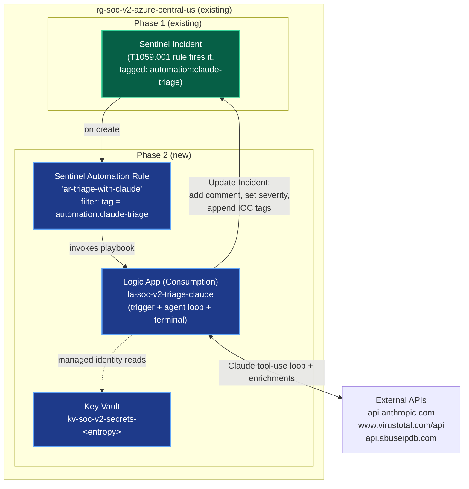

> **▶ Resumed 2026-05-26.** Phase 2 (the lift-and-shift Azure Port that interrupted this work) shipped 2026-05-26. This spec is now **the active "Phase 3" direction.** Title and filename still say "Phase 2" for git-history continuity — read every "Phase 2" in this document as "Phase 3" under the post-2026-05-23-reversal numbering. Plan execution starts at [`../plans/2026-05-23-phase-2-soar-logic-app-plan.md`](../plans/2026-05-23-phase-2-soar-logic-app-plan.md) (which also has a resume context block).
>
> **What changed since this spec was written (2026-05-23) that's worth knowing:**
> - **Phase 1 foundation is intact** but verify on first task — the AMA service on `vm-soc-v2-win` was anomalous during P2 Task 12 (Sysmon UF install): `Get-Service AzureMonitorAgent` returned not-installed. May be a service-name-renames issue (extension-based AMA shows up as `AMAExtHandler`), or may be a real gap. Either way, run a live-fire pre-flight before assuming the Phase 1 trigger chain works.
> - **Splunk + n8n + IRIS now live in Azure** (`vm-soc-v2-splunk` / `vm-soc-v2-n8n` / `vm-soc-v2-iris` in the same RG as `vm-soc-v2-win`). Independent of this spec — Phase 3 doesn't touch them — but useful context for the comparison commentary in Task 20's deliverable doc. The v1 SOAR side is now a moving Azure target, not a stale VMware artifact.
> - **A second saved search shipped during P2** (`T1059.003 - Suspicious cmd.exe IOC References`, 2026-05-19 origin, back-ported to Azure 2026-05-26). The Sentinel side does not yet have a T1059.003 analytics rule. Phase 3 keeps T1059.001 only per spec scope (S2 design future-proofs for D2/D3); adding T1059.003-KQL is a detection-engineering follow-on, not Phase 3 scope.
> - **Empty `iocs[]` finding from P2 Task 24:** Claude judges obvious-synthetic events (demo-GUID, EICAR hash, `.invalid` URL) and suppresses structured-IOC output even when prose surfaces them all with full enrichment. **Same behavior will appear on the Logic Apps side** — not a Phase 3 bug, identical Claude system-prompt; document in Phase 3 acceptance prose if observed, don't chase as a Logic-Apps wiring issue.

**Related:**
- [v2-azure README](../README.md)
- [v2-azure architecture (Phase 1)](../architecture/current-state.md)
- [Phase 1 detection doc — T1059.001 KQL port](../detections/t1059-001-powershell-encoded-azure.md)
- [v1 SOC Triage v3 pipeline (vault)](../../vault/workflows/soc-triage-pipeline.md)
- [P2 Azure Port runbook (v2-azure branch)](../../vault/subprojects/2026-05-23-azure-port/runbook.md) — the parallel-implementation v1 stack now lives in Azure too, with operational docs
- [SOC-Automation-Project Port to Azure (historical — superseded by P2 completion)](../../SOC-Automation-Project-to-Azure-Port.md)


# Phase 2 — SOAR Layer (Logic Apps): Design

The Microsoft-native equivalent of the v1 `SOC Triage v3` n8n workflow, built on the Phase 1 Sentinel foundation.

## Summary

A single Azure Logic App (Consumption tier) acts as the v2 SOAR engine. A Sentinel Automation Rule fires the Logic App whenever a Sentinel incident is tagged `automation:claude-triage`. The Logic App runs the Claude tool-use loop manually (because Logic Apps has no built-in equivalent to n8n's `Message a model` LangChain node), calls VirusTotal and AbuseIPDB as enrichment tools, and terminates by updating the Sentinel incident with Claude's structured triage as a comment + severity update + IOC tags. Secrets live in Azure Key Vault and are read via the Logic App's system-assigned managed identity. The Claude tool-use contract (3 tools, exact schemas) is preserved verbatim from v1 v3 so the comparison commentary doesn't have to apologize for divergence.

## Goals

1. Ship the Microsoft-native equivalent of every functional concern v1 v3 handles (trigger → AI triage with enrichment tools → structured output → case management write-back).
2. Make the agent loop visible in the Logic Apps designer rather than hide it inside code. The user's goal for this phase is *learning Microsoft tooling*; the agent loop is the most interesting part to actually build in the designer.
3. Future-proof for multi-detection rollout via a tag mechanism (so D2/D3 detections opt in by tagging, with no Logic App change).
4. Use Microsoft-native secrets management (Key Vault + managed identity) — no API keys in workflow JSON.
5. Match Phase 1's documentation discipline: living architecture diagram, capture v1↔v2 commentary, single live-fire acceptance test with screenshot evidence.

## Non-goals

- DFIR-IRIS write-back (deliberately replaced by Sentinel-native incidents — see "Locked decisions" below).
- Defender XDR-specific automation (attack disruption, advanced hunting playbooks) — requires MDE licensing the user doesn't have.
- Human approval gate — v3 removed Slack per ADR 0007; v2 follows.
- Network hardening of the Logic App — the Sentinel incident trigger has no public callable endpoint.
- Multi-detection content — Phase 2 ships with T1059.001 only; S2 design future-proofs for D2/D3 but adding detections is detection-engineering work in a separate phase.

## Locked design decisions

Captured here so future visitors can see the brainstorm tree without reconstructing it.

### Decision 1: Where does the triage land? → **Sentinel-native incident (B)**

Considered:
- **A — DFIR-IRIS only** (exact v1 parity): Rejected. Requires cross-cloud network plumbing (Azure → on-prem IRIS at 192.168.129.133) which teaches Azure networking, not Microsoft SOC. Also bypasses Sentinel's native case-management features, which are the most distinct-from-v1 part of the stack.
- **B — Sentinel-native incident** (Update Incident + comment): **Chosen.** Sentinel folds case management directly into the SIEM (assignment, status, severity, comments, evidence/entities, classification). "The Microsoft equivalent of IRIS" is the Sentinel Incident object — Microsoft chose not to ship a separate case-management product at this tier. Same incident also renders in security.microsoft.com Defender XDR portal (user has access). Zero cross-cloud plumbing.
- **C — Both** (parallel terminals): Rejected. Strictly additive to B but front-loads the same cross-cloud problem A has, which would dominate the phase and dilute the SOAR-layer focus.

### Decision 2: How is the Claude tool-use loop implemented? → **Pure Logic App `Until` loop (B1)**

Considered:
- **B1 — Pure Logic App manual Until loop:** **Chosen.** All logic visible in the designer. Verbose JSON in expressions is the price; visibility is the payoff. Matches the "learn Microsoft tooling" goal — Logic Apps is the headline Microsoft SOAR product, and the agent loop is the most interesting part to actually build inside it.
- **B2 — Azure Function for the loop**, Logic App for trigger + terminal: Cleaner code, but moves the interesting part out of the designer. Doesn't serve the learning goal as well at this stage.
- **B3 — Azure AI Foundry agent service:** Most strategically modern Microsoft answer if it works. Foundry's agent runtime support for Anthropic Claude (vs OpenAI) was not verified during brainstorm — would need confirmation before commitment. Deferred.
- **B4 — Hybrid (Logic App orchestration + thin Function for the loop only):** Best engineering shape — clean separation, both surfaces learned. **Captured as a Future Enhancement** (see §13) for after Phase 2 ships.

### Decision 3: Which Sentinel incidents are triaged? → **Generic with opt-in tag (S2)**

Considered:
- **S1 — T1059.001 only:** Simplest scope. Rejected because it requires a follow-up Phase 2.5 to add multi-detection support.
- **S2 — Any incident with `automation:claude-triage` tag:** **Chosen.** Matches v1's design intent (n8n's webhook was generic; only T1059.001 happened to call it). System prompt is technique-agnostic. Adds ~1 extra Automation Rule config (or tag set at analytics-rule level) but no extra Logic App. Future detections opt in by being tagged. "Add a detection → it gets triaged automatically" extensibility belongs in Phase 2, not 2.5.

## Architecture



### Resources (3 new)

| Resource | Name | Why this shape |
|---|---|---|
| **Key Vault** | `kv-soc-v2-secrets-<entropy>` | Microsoft-native secrets store. Holds Anthropic API key, VirusTotal API key, AbuseIPDB API key. Logic App reads via system-assigned managed identity — no secrets in workflow JSON. (Key Vault names are globally unique; `<entropy>` suffix decided at provision time.) |
| **Sentinel Automation Rule** | `ar-triage-with-claude` | Tag filter (`automation:claude-triage`). Decides which incidents fire the Logic App. Apply the tag to the existing T1059.001 Analytics Rule's incidents. Future detections opt in by getting the same tag (S2 design payoff). |
| **Logic App** | `la-soc-v2-triage-claude` | Consumption tier (scales-to-zero, cheapest for lab volume). Stateful workflow. Single Logic App — trigger + agent loop + terminal all in one designer. System-assigned managed identity. Trigger = "Microsoft Sentinel incident" (the incident-scoped one, not alert-scoped — needed for Update Incident write-back scope). |

### Region, naming, RBAC

- **Region:** Central US (matches Phase 1 — no cross-region traffic).
- **Resource group:** `rg-soc-v2-azure-central-us` (existing Phase 1 RG).
- **Naming prefix:** `-soc-v2-*` (matches Phase 1 convention).
- **RBAC:** Logic App's managed identity needs `Microsoft Sentinel Responder` on the resource group (for Update Incident) and `Key Vault Secrets User` on the Key Vault.

## End-to-end sequence (per incident)

1. **Trigger fires** — Sentinel emits incident with `automation:claude-triage` tag. Automation Rule matches. Logic App receives full incident JSON.
2. **Initialize** — Logic App reads Anthropic/VT/AbuseIPDB keys from Key Vault via managed identity. Builds initial `messages` array with one user message containing the incident summary (alert title, severity, entities, alert description, custom details).
3. **Agent loop (Until)** — repeats up to `MAX_ITERATIONS`:
   - POST to `api.anthropic.com/v1/messages` with `messages + tools + system`
   - Branch on `stop_reason`:
     - `tool_use` → execute the tool(s), append each `tool_result` to messages, loop
     - `end_turn` → unexpected (no tool called); set error flag, break
   - Exit when the last tool called was `submit_triage_result` OR iteration cap hit OR error flag
4. **Extract** — pull `submit_triage_result`'s `input` (the structured triage object) out of the last assistant message.
5. **Terminal** — one `Update Incident` action: add comment + set severity + append IOC tags.

## Tool contracts (preserved verbatim from v1 v3)

| Tool | Purpose | Behind it |
|---|---|---|
| `enrich_ip_abuseipdb` | Claude calls when an IP appears | HTTP GET `api.abuseipdb.com/api/v2/check?ipAddress={ip}` with `Key` header |
| `lookup_file_hash_virustotal` | Claude calls when MD5/SHA1/SHA256 appears | HTTP GET `virustotal.com/api/v3/files/{hash}` with `x-apikey` header |
| `submit_triage_result` | Terminal — structured output | Input schema: `severity` (low/medium/high/critical), `summary` (prose), `iocs_enriched[]` (each: `type`, `value`, `verdict`, `source`), `mitre_techniques[]`. **Exact match to v1's A1 schema** so the comparison commentary doesn't have to apologize for divergence. |

## Agent loop internals (designer shape)

```
Until (last_tool_name == 'submit_triage_result'
       OR iteration > MAX_ITERATIONS
       OR error_flag == true)
├── HTTP — POST api.anthropic.com/v1/messages
│       body: { model: 'claude-opus-4-7', system, messages, tools, max_tokens }
├── Parse JSON — Claude response
├── Switch on stop_reason:
│   ├── case 'tool_use':
│   │     For each content block where type=='tool_use':
│   │     ├── Switch on tool.name:
│   │     │   ├── 'enrich_ip_abuseipdb'         → HTTP → AbuseIPDB
│   │     │   ├── 'lookup_file_hash_virustotal' → HTTP → VirusTotal
│   │     │   └── 'submit_triage_result'        → (no HTTP; loop exits next check)
│   │     └── Compose tool_result message → append to messages array
│   ├── case 'end_turn': set error_flag = true
│   └── default:         set error_flag = true
└── Increment iteration counter
```

### Designer quirks to know in advance

- Logic Apps' `Until` is **do-while** (always runs the body at least once), not while. The exit-condition check happens *after* each iteration.
- Appending to the messages array requires composing the new message and using `setProperty` / array-concat expressions. This is the **verbosity tax** for B1's "everything visible in the designer" property. It will be the ugliest part of the workflow JSON.

## Sentinel incident input — fields the Logic App reads

From the Sentinel incident trigger payload:
- `properties.title` → "Alert title" in the user message
- `properties.severity` → context for Claude (Claude can override via `submit_triage_result`)
- `properties.alertDisplayName` (first alert in the alerts array)
- `properties.entities` → typed IOC seeds (IPs, hostnames, hashes, accounts, processes)
- The full custom-details rows of the alert (raw EventData XML excerpts the KQL rule projected)

**v2 win to capture in comparison commentary:** Sentinel entities are typed and richer than Splunk's flat field set. The Logic App can hand Claude better-typed IOC seeds than n8n could.

## Sentinel terminal — Update Incident

One `Microsoft Sentinel — Update Incident` action with three things:

### 1. Add comment (markdown)

```
## Claude triage (claude-opus-4-7)
**Severity:** {severity}
**MITRE:** {mitre_techniques joined}

{summary}

### IOCs enriched
- {ioc.type} `{ioc.value}` → {ioc.verdict} ({ioc.source})
...
```

### 2. Set severity

`submit_triage_result.severity` → Sentinel incident severity enum.

**Caveat — open implementation question.** Sentinel incident severity at the workspace layer is `Informational/Low/Medium/High` (no `Critical` tier in Sentinel-native). Two mapping options:
- **Lossy:** `critical → High`. Simpler, but loses the distinction.
- **Tag-preserved:** `critical → High` AND add a `severity:critical` tag so hunting queries can still find the distinction.

Decide at implementation time. Lean: tag-preserved, because the user is building this for portfolio and losing fidelity in the terminal step is the wrong tradeoff.

### 3. Append tags

One per `iocs_enriched[]` entry, format `ioc:{type}:{value}:{verdict}`. Makes incidents searchable by enriched IOC verdict in Sentinel hunting queries (e.g., `SecurityIncident | where Tags has "ioc:sha256:" and Tags has ":malicious"`).

The triage lands in the incident itself — viewable in both portal.azure.com Sentinel blade AND security.microsoft.com Defender XDR portal.

## Success criterion (the Phase 2 acceptance run)

Phase 2 is "done" when re-firing Atomic Red Team Test 15 produces this end-to-end chain:

1. ATH Test 15 fires on `vm-soc-v2-win` (PowerShell EncodedCommand, same as Phase 1)
2. Sysmon EventID=1 → AMA → LAW → T1059.001 analytics rule → Sentinel incident #N created
3. Automation Rule sees `automation:claude-triage` tag → invokes `la-soc-v2-triage-claude`
4. Logic App run completes successfully (status: Succeeded in run history)
5. Within ~30s of step 3, the Sentinel incident has:
   - A comment with Claude's triage (severity, summary, MITRE, IOCs)
   - Severity updated (likely Medium per v1's pattern)
   - At least one `ioc:` tag (likely the SHA256 of `powershell.exe` from a VT lookup)
6. Claude's triage prose includes a decoded base64 payload (documented native Claude behavior from v1 alerts #51/#52)

**Latency budget:** Phase 1 was 9m24s event → incident. Add ~15-60s for the Logic App. Target: under ~12 min event → triaged incident. This number becomes the v2 SOAR-layer baseline in the comparison commentary.

## Error handling & limits

| Failure mode | Behavior |
|---|---|
| Claude API 4xx/5xx | HTTP action retry policy: 3 retries with exponential backoff. If still failing → comment "Claude triage failed: <status>" → exit. |
| Claude returns `end_turn` without calling `submit_triage_result` | `error_flag` breaks loop → comment "Claude did not return structured triage" → exit |
| Loop iteration cap | `MAX_ITERATIONS = 10`. v1's Opus 4.7 typically calls 1–3 enrichments + submit; 10 is well above natural max but bounded. |
| VT / AbuseIPDB 429 | HTTP retry: 2 retries with longer backoff. If still rate-limited, return `{"error":"rate_limited"}` to Claude as `tool_result` — let Claude reason about partial enrichment and proceed. |
| VT 404 (unknown hash) | Return 404 body as `tool_result`. Claude handles "unknown to VT" naturally (v1 pattern). |
| Update Incident fails | Logic App run fails. Operator catches in incident review. No further escalation (matches v1 v3 — Slack approval was removed per ADR 0007). |

**No retries on the outer loop.** If the run fails, the incident sits without triage — visible state in Sentinel.

## Test methodology

1. Tag the existing T1059.001 analytics rule's incidents with `automation:claude-triage` (set at analytics rule level via `incidentConfiguration.tags`, OR via a second Automation Rule that just adds the tag — verify which is cleaner at impl time).
2. Provision the 3 new resources (Key Vault, Logic App, Automation Rule) per the Architecture section.
3. **Smoke test #1** — manually run the Logic App against a sample incident JSON (Logic Apps "Run with payload" feature). Verify the loop completes and Update Incident lands a comment.
4. **Smoke test #2** — manually invoke the Automation Rule on an existing Phase 1 incident from the Sentinel UI. Verify the playbook fires end-to-end.
5. **Acceptance run** — re-fire ATH Test 15 on `vm-soc-v2-win`. Verify the full chain against the success criterion. Capture run-history + incident-comment screenshots for the Phase 2 deliverable doc.

Same shape as Phase 1's acceptance: single live-fire test, screenshot evidence, latency measured.

## Cost (lab volume)

- Logic Apps Consumption: ~$0.000025 / action × ~50 actions per run = **~$0.001 per triage**
- Key Vault: pennies/month
- Anthropic Opus 4.7: ~$0.05–0.15 per triage (same as v1)
- Total per triage dominated by Claude tokens, not Azure. Trial credits cover the rest of the trial window comfortably.

## Out of scope (explicitly)

- **B4 hybrid Function refactor** — deferred per Decision 2. Captured below as Future Enhancement #1.
- **More detections** — Phase 2 ships T1059.001 only. S2 future-proofs for D2/D3 via the tag mechanism; adding detections is detection-engineering work in a separate phase.
- **DFIR-IRIS cross-cloud** — explicitly not. Sentinel Incident IS the Microsoft equivalent of IRIS at this tier.
- **Defender XDR-specific automation** (attack disruption, advanced hunting playbooks) — requires MDE licensing.
- **Logic App network hardening** — Consumption Logic Apps with the Sentinel incident trigger have no public callable endpoint.
- **Human approval gate** — v3 removed Slack per ADR 0007; v2 follows.

## Future enhancements (captured here so they're not lost)

1. **B4 — Hybrid Function for agent loop.** Refactor after Phase 2 ships. Pure additive change — Logic App designer keeps the visible trigger/terminal/error scaffolding; a thin Function takes only the verbose message-array manipulation. Best engineering shape, deferred to keep this phase focused on Logic Apps mastery.
2. **Severity-critical tag fallback** (`severity:critical`) — preserves the `critical` distinction if Sentinel maps `critical → High` lossily. May land in Phase 2 itself depending on which mapping option is chosen at impl time.
3. **Multi-detection rollout** — when D2/D3 detections ship, tag them and watch the Logic App handle them with no code change (S2 design payoff). Detection-engineering work, separate phase.
4. **Sentinel Workspace Function for Sysmon field extraction** — Phase 1.5 idea from the Phase 1 detection doc; would clean up future KQL detections by centralizing the EventData XML regex.
5. **DFIR-IRIS cross-cloud as Phase 3 additive comparison** — only if the portfolio narrative demands the strict A/B comparison after Phase 2 ships.

## Open implementation-time questions

These are flagged here so the implementation plan can pick them up rather than leaving them as surprises:

1. **Severity-Critical mapping** — `critical → High` lossy, or `critical → High + tag severity:critical`? Lean: tag-preserved.
2. **Tag-application surface** — set `automation:claude-triage` at the analytics rule level (`incidentConfiguration.tags`), or via a separate Automation Rule that adds the tag? Verify which is cleaner; both work.
3. **Key Vault name entropy** — globally unique requirement means `kv-soc-v2-secrets` alone may collide. Add suffix at provision time.
4. **Azure AI Foundry Anthropic support** — not verified during brainstorm. If user revisits B3 in the future, confirm Foundry's agent runtime hosts Claude with tool-use parity to the direct API before commitment.
